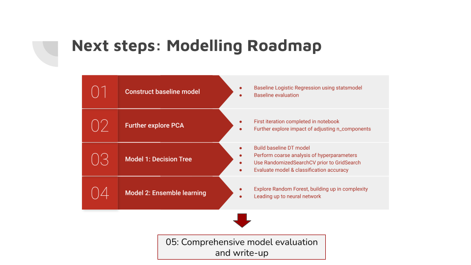
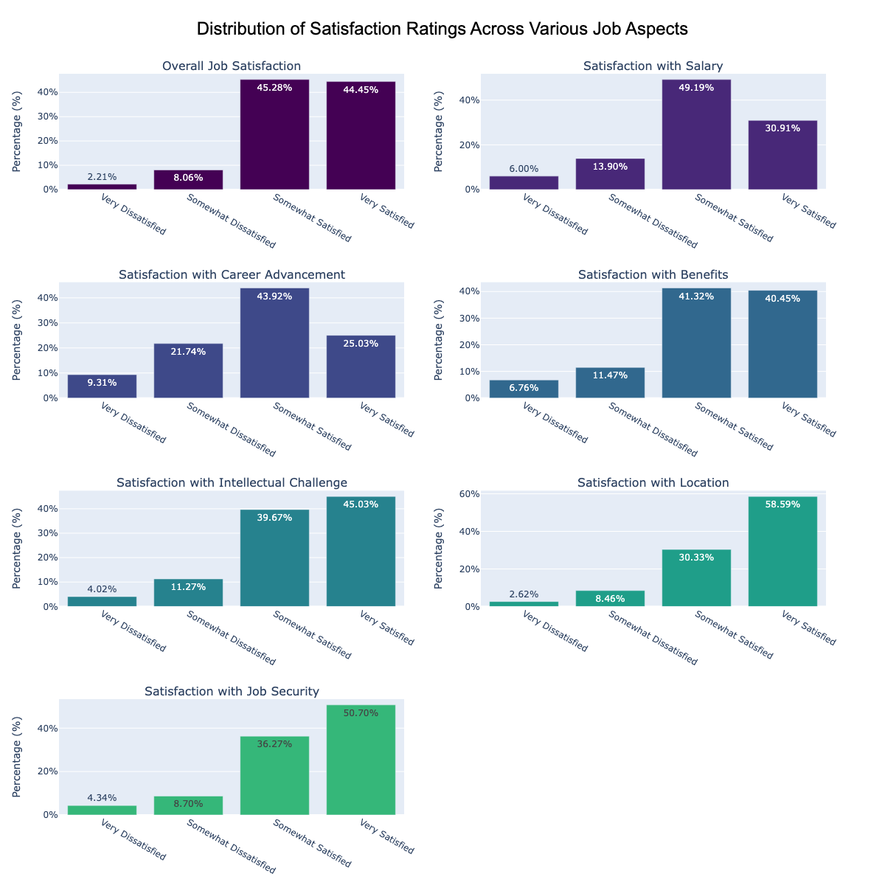
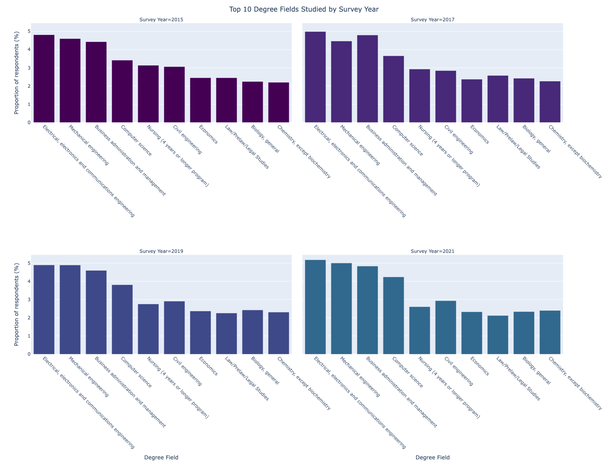

## Project Title
=========================

### Executive Summary

#### **What is the problem we're trying to address?**

* Job matching and striving for job satisfaction continues to be a critical issue in today’s labour market (and something many of us can relate to, more personally!). 
* We talk a lot about the skills we need to be the right fit for a job, our work-life balance, and levels of financial wellbeing we aspire to. 
* But it continues to be challenge to get the ‘right fit’, as we know from stark unemployment figures
* Often studies and articles focus on salary as the key outcome for a successful job match
* We can go beyond this to consider: 

 **What actually influences an individual's likelihood of job satisfaction?** 
* **Can we develop predictions that enable to predict this better?**

#### **What is the data science opportunity?**

* How might we use machine learning to better predict the likelihood of 'high job satisfaction' for a jobseeker or individual currently in employment?
* How can we use ML classification to predict whether an individual is likely to be 'highly satisfied' in their job?
* Using ML, we have the opportunity to use our insights from classification modelling to develop recommendations for jobseekers seeking greater career satisfaction, as well as provide insights to policymakers who often grapple prioritising and addressing inequities in the labour market

#### **What data are we using?**

The U.S. National Survey of College Graduates (NSCG) is a recurring survey conducted by the National Science Foundation (NSF) that collects detailed information on the educational background, employment status, and career paths of individuals with at least a bachelor's degree in the United States. 

* The NSCG is used to assess trends in the labor market, particularly within science and engineering fields, and to inform policies related to education, workforce development, and economic competitiveness. 
* The survey provides valuable insights into the experiences and outcomes of college graduates, including factors like job satisfaction, salary, and the relevance of education to employment.

The NSCG dataset is collected in a cyclical manner, with major surveys conducted every two to three years. 

This means that each dataset provides a **snapshot of the U.S. college graduate population at a specific point in time**, allowing for both cross-sectional analysis and, to some extent, longitudinal insights when comparing data across different survey years.

### Data Dictionary
| Raw Data - Variable_Name   | Variable Name              | Description                                              | Data Structure                                                                                                           |
|----------------------------|----------------------------|----------------------------------------------------------|--------------------------------------------------------------------------------------------------------------------------|
| JOBSATIS                    | job_satisfaction           | Job satisfaction                                         | 1: Very satisfied, 2: Somewhat satisfied, 3: Somewhat dissatisfied, 4: Very dissatisfied, L: Logical Skip                |
| SATSAL                      | satisfaction_salary        | Satisfaction with job's salary                           | 1: Very satisfied, 2: Somewhat satisfied, 3: Somewhat dissatisfied, 4: Very dissatisfied, L: Logical Skip                |
| SATADV                      | satisfaction_advancement   | Satisfaction with advancement opportunities              | 1: Very satisfied, 2: Somewhat satisfied, 3: Somewhat dissatisfied, 4: Very dissatisfied, L: Logical Skip                |
| SATBEN                      | satisfaction_benefits      | Satisfaction with benefits                               | 1: Very satisfied, 2: Somewhat satisfied, 3: Somewhat dissatisfied, 4: Very dissatisfied, L: Logical Skip                |
| SATCHAL                     | satisfaction_challenges    | Satisfaction with job's intellectual challenge            | 1: Very satisfied, 2: Somewhat satisfied, 3: Somewhat dissatisfied, 4: Very dissatisfied, L: Logical Skip                |
| SATLOC                      | satisfaction_location      | Satisfaction with job location                           | 1: Very satisfied, 2: Somewhat satisfied, 3: Somewhat dissatisfied, 4: Very dissatisfied, L: Logical Skip                |
| SATSEC                      | satisfaction_security      | Satisfaction with job security                           | 1: Very satisfied, 2: Somewhat satisfied, 3: Somewhat dissatisfied, 4: Very dissatisfied, L: Logical Skip                |
| SALARY                      | salary                     | Salary (annualized)                                      | 0-9999996: Value, 9999998: Logical Skip                                                                                   |
| FACSOC                      | importance_society_contribution | Self-rated assessment of job's contribution to society   | 1: Very important, 2: Somewhat important, 3: Somewhat unimportant, 4: Not important at all, L: Logical Skip             |
| OCEDRLP                     | job_degree_relation        | Extent that principal job is related to highest degree    | 1: Closely related, 2: Somewhat related, 3: Not related, L: Logical Skip                                                 |
| N2MRMED                     | recent_degree_field        | Field of study of major for the most recent degree        | Code for field of study during reference week - best code                                                                |
| MRDG                        | recent_degree_type         | Type of degree for most recent degree                    | 1 - Bachelor's, 2 - Master's, 3 - Doctorate, 4 - Professional degree                                                    |
| MRDACYR                     | academic_year_most_recent_degree | Academic year of award for most recent degree           | Year of most recent degree completion (numeric)                                                                         |
| GENDER                      | gender                     | Gender                                                   | F: Female, M: Male                                                                                                       |
| AGE                         | age                        | Age                                                      | Age number                                                                                                              |
| AGEGR                       | age_group                  | Age group (5-year intervals)                             | 20: Ages 24 or younger, 25: Ages 25-29, 30: Ages 30-34, etc.                                                             |
| RACEM                       | race                       | Race                                                     | 1: Asian ONLY, 2: American Indian/Alaska Native ONLY, 3: Black ONLY, 4: White ONLY, 5: Native Hawaiian/Other Pacific Islander ONLY, 6: Multiple Race |
| EMSECDT                     | employer_sector_detailed   | Employer sector (detailed codes)                         | 11: 4-yr college/university, 12: 2-yr college, 21: Business/Industry, 22: Government, etc.                               |
| EMSECSM                     | employer_sector_summary    | Employer sector (summary codes)                          | 1: Educational Institution, 2: Government, 3: Business/Industry, L: Logical Skip                                         |
| EMSIZE                      | employer_size              | Employer size                                            | 1: 10 or fewer employees, 2: 11-24 employees, 3: 25-99 employees, 4: 100-499 employees, etc.                             |
| EMST                        | employer_location          | State/country code for employer                          | Various codes for U.S. regions, states, and countries, L: Logical Skip                                                   |
| MARSTA                      | marital_status             | Marital Status                                           | 1: Married, 2: Living in a marriage-like relationship, 3: Widowed, 4: Separated, 5: Divorced, 6: Never married          |
| RESPLO3                     | respondent_location_code   | 3-Digit respondent location (state/country code)         | Various codes for U.S. regions, states, and countries, L: Logical Skip                                                   |
| CTZUSIN                     | citizenship_status         | U.S. citizenship status                                  | N: Non-U.S. citizen, Y: U.S. citizen                                                                                     |
| CHLVIN                      | children_in_household      | Children living in household                             | N: No, Y: Yes                                                                                                            |
| CLICNMBR                    | active_certifications      | Number of active certifications/licenses                 | Numeric value: 0 - n certifications/licenses currently active                                                            |
| LWMN                        | last_worked_month          | Month when the individual last worked before the current job | 1-12: Month (1 for January, 2 for February, etc.)                                                                        |
| LWYR                        | last_worked_year           | Year when the individual last worked before the current job | Year (numeric)                                                                                                          |
| STRTYR                      | start_year_current_job     | Year when the individual started their current principal job | Year (numeric)                                                                                                          |                                |
| N3OCPR                      | occupation_name            | Occupation code for the principal job                    | Code that best describes the principal job held during the week of February 1                                            |

#### Links to primary datasets used for this project

https://ncses.nsf.gov/surveys/national-survey-college-graduates/2021
https://ncses.nsf.gov/423/assets/0/file/ncses_nscg.pdf
https://ncses.nsf.gov/pubs/nsf23306/assets/nsf23306.pdf
https://ncses.nsf.gov/explore-data/microdata/national-survey-college-graduates

### Overview of modelling roadmap

### What have we learnt from conducting in-depth Exploratory Data Analysis?

# 5. Summary

Based on what we've learned throughout our EDA here are some key hypotheses we constructed, feature variables of interest, and next steps for predicting whether an individual is "highly satisfied" with their job:

1. Key Hypotheses:

* Job Duration Hypothesis: Longer job duration (in months or years) is positively associated with higher job satisfaction. Those who have been in their jobs longer are more likely to be highly satisfied.

* Salary Hypothesis: Higher salaries are associated with higher job satisfaction. Individuals with higher salaries are more likely to report being highly satisfied.

* Work Benefits and Security Hypothesis: Factors like job benefits, advancement opportunities, and job security contribute to higher satisfaction. Individuals who report satisfaction in these areas are more likely to be highly satisfied overall.

* Job-Related Contribution Hypothesis: Individuals who feel their job contributes to society or is aligned with their degree may experience higher job satisfaction.

* Employer Characteristics Hypothesis: Employer sector (e.g., public, private) and size might influence job satisfaction. For instance, larger employers might provide more job security or benefits that could increase satisfaction.

* Personal and Demographic Factors Hypothesis: Variables like age, marital status, gender, and certifications may influence job satisfaction. For example, having certifications or more life stability (marital status, children) may be linked to higher satisfaction.

Key Feature Variables of Interest:

Job Duration `job_duration_months`: Measuring the length of time in the current job.

Salary `salary`: The individual's salary level.

Job Benefits `satisfaction_benefits`: Satisfaction with benefits.

Advancement Opportunities `satisfaction_advancement`: Satisfaction with job advancement opportunities.

Job Security `satisfaction_security`: Perception of job security.

Societal Contribution `importance_society_contribution`: How important the individual perceives their job's contribution to society.

Job-Degree Relation `job_degree_relation`: Whether the job aligns with the individual's degree.

Employer Sector `employer_sector`: Type of employer.

Employer Size `employer_size_category`: Size of the employer.

Certifications `active_certifications`: The number of active certifications.

Demographic Factors: `Age`, `marital status`, `female`, and `children_in_household`.

#### Check out key visualisations illustrating job satisfaction scores. popular degree subjects across survey respondents, and an investigation of median salary by US region:

* 
* 
* [Investigation of median salary by US region - html file](./visualisations/map.html)

### Baseline Model findings: Logistic Regression (coefficients, odds ratio, and model performance)

#### Overall, we learnt about key actionable insights for our stakeholders, including jobseekers and labour market policymakers. These linked to:

* **Satisfaction with career advancement as the biggest predictor of overall job satisfaction.**

* Career growth is a huge factor for employees, and influences their job satisfaction. Holding all else constant, it continues to be a signifciant predictor suggesting salary alone doesn't suffice.

#### Other learnings included:

**Employer Size**

* Finding: Graduates in smaller companies report higher job satisfaction.
* Policy Insight: Promote opportunities in SMEs, as they may offer more personalized career growth and contribute positively to job satisfaction and the economy.

**Ethnicity**

* Finding: White graduates report slightly higher job satisfaction.
* Policy Insight: Address disparities in job satisfaction across ethnic groups by investigating and addressing contributing factors.

**Degree Relevance and Field:**

* Finding: Graduates working in fields related to their degrees report higher job satisfaction.
* Policy Insight: Align higher education programs with job opportunities to boost job satisfaction for graduates.

#### We also learnt more about our model performance, to inform our next steps as part of our modelling roadmap:

* Accuracy: we saw a marginal improvement in our train accuracy after carrying out backwards selection on a logistic regression model. However, when we evaluate performance on unseen data, we can see clear overfitting of our model to the training data - our test accuracy was much lower at 63%.

* High Precision for Positive Class: This indicates that the model is reliable in predicting high satisfaction, but we need to ensure it also identifies all true positives. Improve recall for high satisfaction by potentially adjusting the classification threshold or using techniques like oversampling the minority class.

* Low Recall for Positive Class: Address the high number of false negatives by exploring other models or techniques that might capture more positives, such as ensemble methods or different threshold settings.

### Organization

#### Structure of notebooks

Located in the `notebooks` section of this repo, here's an overview of what these notebooks cover:

- [Introduction to data and reliminary EDA](./notebooks/01%20Introduction%20to%20Data%20and%20Preliminary%20EDA.ipynb): This notebook introduces the data we're focusing on, with initial EDA for 2021 survey data.
- [Merging data and preprocessing](./notebooks/02%20Merging%20survey%20data,%20and%20initial%20preprocessing.ipynb): This notebook merges all survey data acorss 2015, 2017, 2019, 2021 getting this ready for in-depth EDA and preprocessing for our baseline modelling.
- [Further EDA](./notebooks/03%20Further%20EDA%20and%20preprocessing.ipynbb): This notebook conducts in-depth exploration of our fully merged and cleaned dataset.
- [Baseline Modelling](./notebooks/modeling.ipynb): In this notebook, we train our 'base model': logistic regression using statsmodel.
- [Model 1: Decision Tree](./notebooks/05%20Model%201:%20Decision%20Tree.ipynb). Here, we transition to more advanced modelling and ML techniques, based on learnings form our base model.

#### Repository 

* `data` and `data_for_eda`
    - contains link to copy of the dataset 
    - saved copy of aggregated / processed data

* `model`
    - `joblib` dump of final model(s); *to be updated*

* `notebooks`
    - contains all final notebooks involved in the project

* `project_docs`
    - contains presentations from sprint 1 to 3, and additional supplementary materials where appropriate

* `references`
    - contains any academic papers of literature used to inform this project

* `src`
    - Contains the project source code (refactored from the notebooks): *to be updated*

* `.gitignore`
    - Part of Git, includes files and folders to be ignored by Git version control

* `nivi_capstone.yml`
    - Conda environment specification for my capstone project

* `README.md`
    - Project landing page (this page)

* `LICENSE`
    - Project license

#### Links to primary datasets used for this project

https://ncses.nsf.gov/surveys/national-survey-college-graduates/2021
https://ncses.nsf.gov/423/assets/0/file/ncses_nscg.pdf
https://ncses.nsf.gov/pubs/nsf23306/assets/nsf23306.pdf
https://ncses.nsf.gov/explore-data/microdata/national-survey-college-graduates
