<!-- Images above the title -->

    
    

<!-- Centered title with styling -->
<h1 style="text-align: center; font-family: Arial, sans-serif; font-size: 36px; font-weight: bold;">
    Who’s likely to love their job? A Predictive Tool for Job Satisfaction and Key Drivers
</h1>

<!-- Subtitle (optional) -->
<h2 style="text-align: center; font-family: Arial, sans-serif; font-size: 24px; color: grey;">
    Developing predictions and actionable insights to support labour market policymakers and jobseekers 
</h2>

---
## Table of Contents

1. [Problem Space](#problem-space)

2. [Summary of Data Cleaning and Preprocessing](#1-summary-of-data-cleaning-and-preprocessing)

2. [Insights from Exploratory Data Analysis and Baseline Modelling](#2-insights-from-exploratory-data-analysis-and-baseline-modelling)

3. [Model construction and evaluation](#3-model-construction-and-evaluation)

4. [Findings from Machine Learning Classification: Feature Importance](#4-findings-from-machine-learning-classification-feature-importance)

5. ['So What?' Value for policymakers and jobseekers](#5-so-what-value-for-policymakers-and-jobseekers)

6. [Next Steps](#6-next-steps)

7. [Final Comments and Reflections](#7-final-comments-and-reflections)

8. [Note on repository](#8-note-on-repository)

---
### If you want to get into the nitty gritty of this project, here are key notebooks:

- 00 [Data dictionary and mappings](./notebooks/00%20Data%20dictionary%20and%20mappings.ipynb)
- 01 [Introduction to Data](./notebooks/01%20Introduction%20to%20Data%20and%20Preliminary%20EDA.ipynb)
- 02 [Merging Survey Data](./notebooks//02%20Merging%20survey%20data,%20and%20initial%20preprocessing.ipynb)
- 03 [Further EDA and Preprocessing](./notebooks/03%20Further%20EDA%20and%20preprocessing.ipynb)
- 04 [Baseline Model 1 logistic regression](./notebooks/04%20Baseline%20Model%201:%20development%20roadmap%20&%20baseline%20logit%20model.ipynb)
- 05 [Preparing for Advanced Modeling](./notebooks/05%20Prep%20for%20advanced%20modelling%20and%20exploring%20PCA.ipynb)
- 06 [Model 2 - Decision Tree](./notebooks/06%20Model%202%20-%20Decision%20Tree.ipynb)
- 07 [Model 3 - Random Forest](./notebooks/07%20Model%203%20-%20Random%20Forest.ipynb)
- 08 [Model 4 - Neural Network](./notebooks/08%20Model%204%20-%20Neural%20Network.ipynb)
- 09 [Evaluation](./notebooks/09%20Evaluation.ipynb)
- 10 [Summary of findings and next steps](./notebooks/10%20Summary%20of%20findings%20and%20next%20steps.ipynb)

If not then please read ahead...

---

# Problem Space 

Finding a job we ‘love’ is hard and critical in today’s labor market to support productivity and wellbeing - and something we can all relate to on a personal level.

This project seeks to:
- Predict job satisfaction based on various attributes like career advancement, salary, and job duration.
- Understand the drivers of job satisfaction through feature importance and model interpretations.

---

# 1. Summary of Data Cleaning and Preprocessing

The U.S. National Survey of College Graduates (NSCG) is a recurring survey conducted by the National Science Foundation (NSF) that collects detailed information on the educational background, employment status, and career paths of individuals with at least a bachelor's degree in the United States.

The dataset used for this project spans four years of survey data collected by the NSF, covering a wide array of variables related to employment, job satisfaction, job tenure, education, and socio-economic factors.

A total of **200+ survey questions** were asked in the original survey, and through careful reading of survey questions and user guide documentation, we identified 31+ employment-specific questions asked by the creators of the survey (before we began more in-depth feature engineering, selection, and preprocessing!).

#### Links to primary datasets used for this project

https://ncses.nsf.gov/surveys/national-survey-college-graduates/2021
https://ncses.nsf.gov/423/assets/0/file/ncses_nscg.pdf
https://ncses.nsf.gov/pubs/nsf23306/assets/nsf23306.pdf
https://ncses.nsf.gov/explore-data/microdata/national-survey-college-graduates

#### Cleaning Process:

The process of cleaning the data involved multiple steps to ensure consistency and accuracy before any modeling could take place. Below is a summary of the key challenges and how they were addressed:

| **Challenge**                                      | **Approach to Resolution**                                                                 |
|----------------------------------------------------|--------------------------------------------------------------------------------------------|
| Inconsistent variable mappings across years        | Used **lists** and **loops** to map SAS format variables across years; checked for mismatches using assertions. |
| Understanding relevant survey questions from 200+ questions | Used domain knowledge to identify **31 core job-related survey questions** relevant for predicting satisfaction. |
| Appending datasets from four survey years          | Inspected one year’s data in detail, then **appended** all years together after data structure validation. |
| Handling missing values and mismatches             | Ensured no missing key columns and values, adjusted mappings, and used proper fill methods for missing data. |

#### Preprocessing Techniques:

### (a) Respondents generally liked their jobs...with the distribution of scores indicating opportunity for binary classification

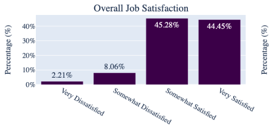

The majority of respondents fall into the two highest satisfaction categories: 

**45.28%** are *Somewhat Satisfied* and **44.45%** are *Very Satisfied*. Together, they account for nearly 90% of the population, which suggests a strong skew towards higher satisfaction.

The two lower satisfaction categories—*Very Dissatisfied* (**2.21%**) and *Somewhat Dissatisfied* (**8.06%*)—comprise only about 10% of the population. This imbalance justified grouping the satisfaction scores into two broader categories to better capture the underlying distribution.

Furthermore, Policymakers and jobseekers are primarily interested in knowing whether an individual is generally satisfied or dissatisfied with their job. Grouping into **'High Satisfaction'** and **'Low Satisfaction'** provides more actionable insights for decision-making and intervention design, without diluting the predictive power of the model by focusing on minor distinctions.

Thus, the decision to code the target variable as a binary classification of **'High Satisfaction'** or **'Low Satisfaction'** was both a practical and methodological choice, grounded in the data's distribution and the project's goals.

### (b) Components of 'overall job satisfaction' showed a similar distribution - suggesting focusing on 'overall' satisfaction is more suited as our target

#### For example, `satisfaction with salary`, `career advancement` and `benefits` scores followed a very similar pattern to `overall satisfaction`...

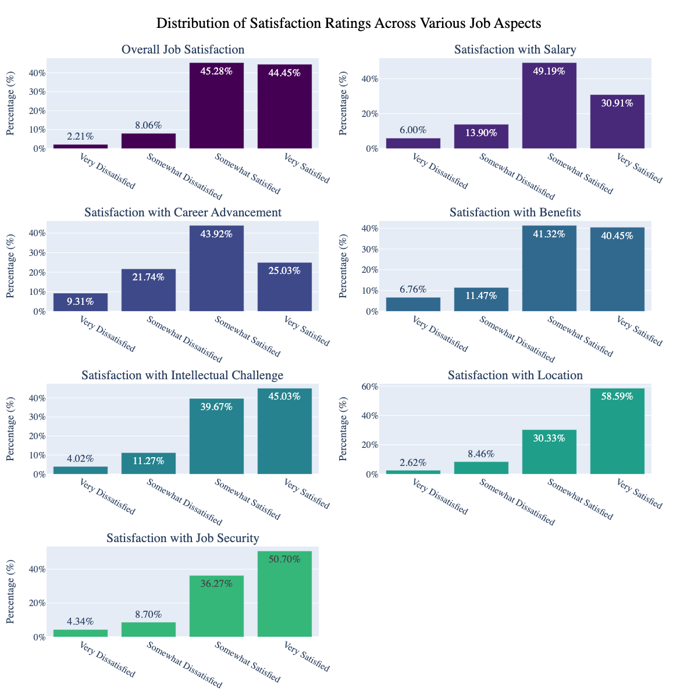

#### Interesting! So we decided to explore: **how much do these other components of job satisfaction contribute to overall job satisfaction?**

### (c)  After coding our 'overall satisfaction' score as binary, we had to address the resulting class imbalance using oversampling...

#### Class imbalance before and after applying SMOTE:

    

        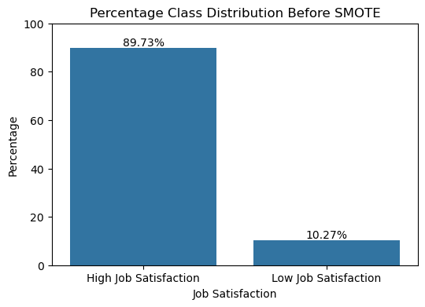
        
Target Distribution Before SMOTE

    

    

        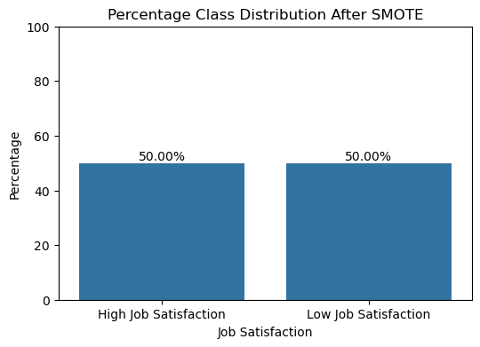
        
Target Distribution After SMOTE

    

#### As we can see above, we address the original 90% positive/'High Satisfaction' class imbalance by applying SMOTE.

#### This was one of many steps taken to get our data ready for modelling. The table below summarises key techniques applied:

| **Preprocessing Technique**                        | **Rationale/Impact on Model Performance**                                    |
|----------------------------------------------------|-----------------------------------------------------------------------------|
| Binary coding of target variable (`High Satisfaction` (1), `Low Satisfaction` (0)) | Converted job satisfaction into a **binary classification** task based on distribution analysis. |
| Feature engineering for `job_duration`             | Created a new variable to capture job tenure based on the start year of the current job. |
| Aggregation of categorical variables               | Combined low-frequency categories (e.g., ethnicity, region) to avoid sparsity and improve model robustness. |
| One-hot encoding for categorical variables         | Ensured models could interpret categorical variables by converting them into binary vectors. |
| Standard Scaler                                    | Standardized numeric features to ensure features were on a comparable scale. |
| Addressing class imbalance using SMOTE             | Applied **SMOTE**, oversampling, to create synthetic examples and address class imbalance (90% 'High Satisfaction'). |

Through the data cleaning and preprocessing steps, the dataset was refined and optimized for machine learning models, ensuring that both the quality and usability of the data were maintained throughout the project.

For more detail, see our notebooks on preprocessing:

1. [Merging Survey Data](./notebooks/02%20Merging%20survey%20data,%20and%20initial%20preprocessing.ipynb)
2. [Initial Preprocessing](./notebooks/03%20Further%20EDA%20and%20preprocessing.ipynb)
3. [Preparation for Advanced Modelling](./notebooks/05%20Preparing%20for%20advanced%20modelling.ipynb)

---

# 2. Insights from Exploratory Data Analysis and baseline modelling

### (a)  Many respondents felt their job is important to society...and aligned well to the degree they studied. Perhaps these are good indicators of 'high satisfaction'?
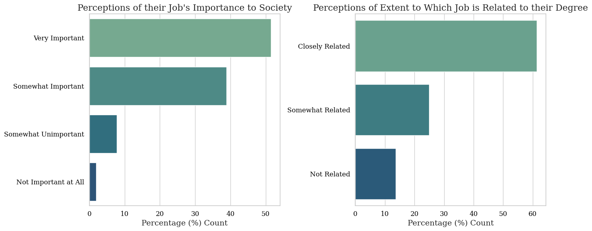

* #### Over 50% report their job as ‘very important’ to society

* #### Over 60% report their job as ‘closely related’ to their academic background. Another potential indicator of ‘highly satisfied’ employees

### (b)  Our correlation matrix showed the statistical significance of a lot of features in the dataset in influencing 'high job satisfaction'...
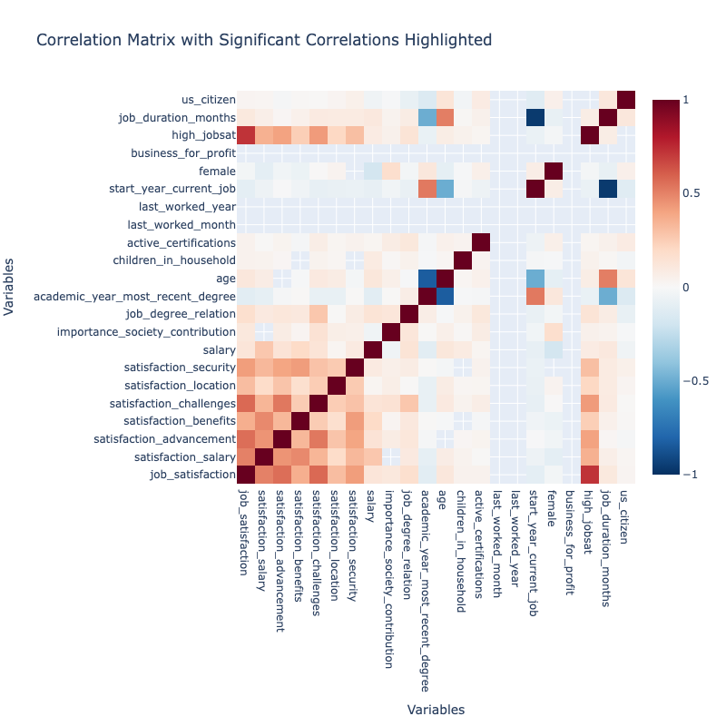

##### 1. Our newly constructed `job_duration` matters - and has the potential to positively influence job satisfaction

##### 2. Components of job satisfaction scores, like your `satisfaction with career advancement opportunities, benefits and intellectual challenge' are signficiant influences on job satisfaction (deeper shades of red indicating stronger positive Pearson's correlation coefficients)

##### 3. Sentiments may vary by year of survey, for example respondents asked during a post Covid era (2021) may not have been as satisfied as their counterparts form previous years

### (c)  Results from our **baseline** logistic regression confirmed a lot of our hypotheses, telling us the top 'predictors' of job satisfaction...

#### Highlights included, satisfaction with career advancement as **key**, job tenure, relevance to the degree you studied (people want to use the skills they learnt!), salary, and even marital status.
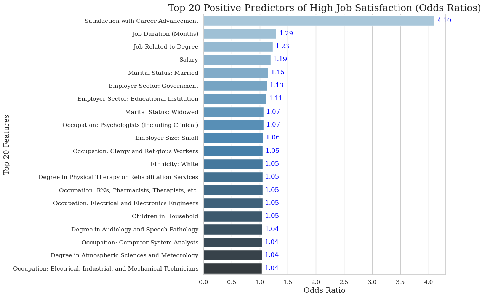

# 3. Model construction and evaluation

### We wanted to go beyond this to see if we could improve our ability to classify 'Highly Satisfied' versus 'Unsatisfied' employees, developing a modelling roadmap:

### (a) Here's a recap of the 4 models we constructed, and key techniques and hyperparameter tuning:

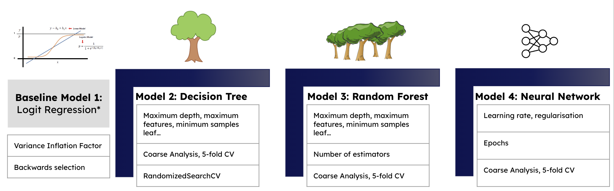

### (b) Random Forest came out on top, for both train...and test data accuracy
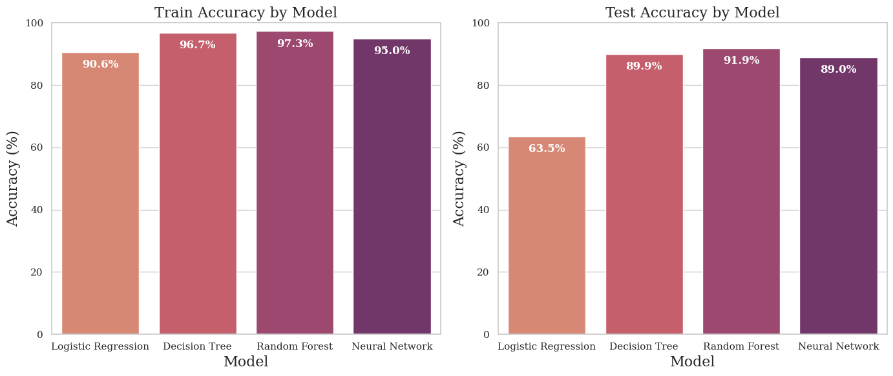

### (c) All models did better than 'random guessing', with the most complex models doing best (Random Forest and Neural Network)

#### Across all thresholds, Random Forest had the highest overall performance with an AUC score of 0.91:
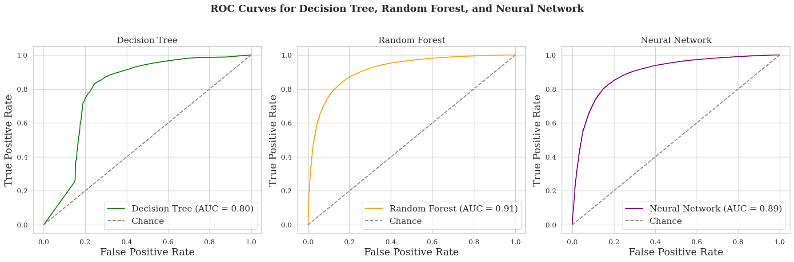

### (d) We saw good classification accuracy, but there's room for improvement for both our Random Forest and Neural Network models...

#### Our models are still getting 'confused' when it comes to classifying individuals with 'Low Satisfaction', given the original class imbalance in our dataset...

    

        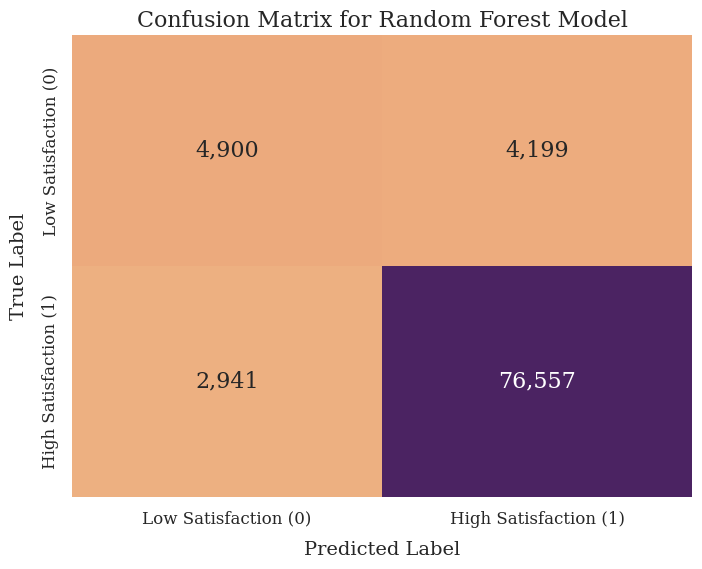
        
Confusion Matrix - Random Forest

    

    

        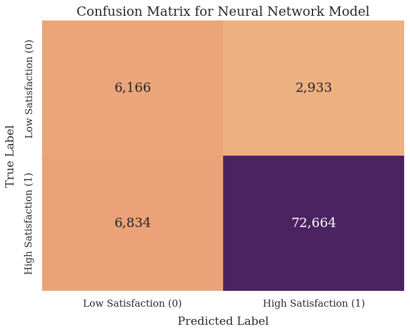
        
Confusion Matrix - Neural Network

    

### How can we interpret these confusion matrices?

1. The Random Forest performs well in predicting 'High Satisfaction' but struggles with 'Low Satisfaction', primarily due to the high number of false positives. Improving minority class precision could significantly enhance model performance.

2. The Neural Network shows better performance in predicting 'Low Satisfaction' with fewer false positives, but at the cost of a higher number of false negatives for 'High Satisfaction.' This indicates a trade-off between precision for Class 0 and recall for Class 1.

So future iterations of the models need to work at addressing these misclassifications. Here are some recommendations:
### Overall recommendations for improving model performance

Given that class imbalance techniques (such as SMOTE) have already been applied, our next steps should focus on **refining and optimising hyperparameters** using robust approaches like **RandomizedSearchCV** for broader exploration and **GridSearchCV** for fine-tuning. Below are specific recommendations for improving performance through better hyperparameter tuning approaches:

#### 1. Hyperparameter Tuning for Random Forest and Neural Networks:

- **RandomizedSearchCV**: This approach is ideal for exploring a wide range of hyperparameters without the computational intensity of an exhaustive search. We can use this to identify key hyperparameters such as tree depth, number of trees, and sample sizes that offer a good trade-off between model complexity and performance. Our next steps would be to perform this on our neural network model to finetune it.
  
- **GridSearchCV**: After narrowing down promising ranges through RandomizedSearchCV, we can apply **GridSearchCV** to more precisely fine-tune specific hyperparameters. This approach works well once a range has been identified, allowing for an exhaustive search within smaller parameter spaces, ensuring optimal model performance.

#### 2. Consider Alternative Models:

- **Gradient Boosting (e.g., XGBoost, LightGBM)**: These models are well-suited for handling imbalanced datasets and often outperform Random Forests in many cases. We might start with **RandomizedSearchCV** to explore a broad range of hyperparameters (e.g., boosting rounds, learning rates, tree depth) and then fine-tune with **GridSearchCV** once the optimal ranges have been identified.

- **Threshold Tuning**: Consider adjusting the decision threshold for classification. Instead of using the default threshold (e.g., 0.5), use **precision-recall curves** to find an optimal threshold that minimizes false positives for 'Low Satisfaction' while maintaining high recall for 'High Satisfaction.'

### Why bother?

1. Our Random Forest model will provide great insight into drivers of 'High Satisfaction' and greater accuracy of classifying these satisfied individuals - important for understanding how common high satisfaction is, and 'ingredients of success'

2. While Neural Networks are computationally expensive, it has really good potential to **better identify unsatisfied individuals** (minority class) and provide insights into how we can target and drive up satisfaction for these employee groups. So it's certainly worth the time and effort to tune this further!

# 4. Findings from Machine Learning Classification: Feature importance

### (a) We analysed feature importance from our best-performing model, the Random Forest, to understand which factors are most influential in predicting job satisfaction.

### Feature Importance (MDI) from Random Forest

This chart shows the **Top 10 Feature Importances** from the Random Forest model using the **Mean Decrease in Impurity (MDI)** method, which is a common technique to estimate feature importance in tree-based models.

#### What MDI Means:
- **MDI (Mean Decrease in Impurity)** measures the total decrease in **Gini impurity** or **entropy** across all trees in the forest that a particular feature contributes to when making splits. 
- Essentially, MDI quantifies how much a feature helps reduce uncertainty or "impurity" about the outcome (in this case, job satisfaction).
- The larger the mean decrease in impurity for a feature, the more important it is deemed to be in predicting the target variable.

#### Key Observations:
1. **Satisfaction with Career Advancement** is by far the most important feature, with the highest MDI score. This aligns well with our overall hypothesis and problem statement. Jobseekers and employees are likely to place great value on opportunities for growth, and satisfaction with career advancement has emerged as a key driver for predicting overall job satisfaction.

2. **Satisfaction with Intellectual Challenge during Job** also ranks highly in feature importance. This emphasises the importance of engaging, meaningful work—again, a key consideration in why people might report high satisfaction with their jobs.

As do a number of job satisfaction-related variables...

#### How This Tallies with Previous Interpretations:

- This ranking of feature importance supports the **story we've been telling** through our exploratory data analysis (EDA) and model evaluations: 

  - **Non-monetary factors** such as satisfaction with career growth, intellectual stimulation, and job security have a significant impact on overall job satisfaction.
  - While salary and job tenure matter, they play a **secondary role** compared to factors that relate to personal fulfillment and job stability.
  
- The model results suggest that **career development** and opportunities for **challenging, meaningful work** are the strongest predictors of high job satisfaction, which is consistent with the narrative we’ve been building throughout our analysis.

By focusing on these core drivers of satisfaction, we can provide actionable insights for both **jobseekers** and **policymakers**, reinforcing the value of aligning personal career goals with workplace opportunities for growth, stability, and intellectual engagement.

### We also explored local interpretations using **LIME** (Local Interpretable Model-agnostic Explanations), to explain what features contribute most to an individual’s probability of high job satisfaction.

Our goal was to interpret individual predictions for job satisfaction using LIME (Local Interpretable Model-agnostic Explanations). LIME provides local explanations, meaning it explains how certain features of a particular instance influence that specific prediction (whether it’s predicting high or low satisfaction).

In this case, we're plotting the probability scores for four individual test instances. Each plot shows the model's predicted probability of 'High Satisfaction' vs. 'Low Satisfaction' for a single person or 'test instance', using 4 different rows of our X_test data. 

## Putting this into practice

Let's take one of the examples/test instances we ran using LIME, as a potential user who's interested in learning about what could be informing their job satisfaction.

In this case our random forest model and LIME seeks to explain one of the 'test instances' we see, to explain the probability score, and contributing factors:

## For one particular test instance, it outputs the following probability score and feature importance/coefficients:

    

        
        
LIME Predicted Probabilities

    

    

        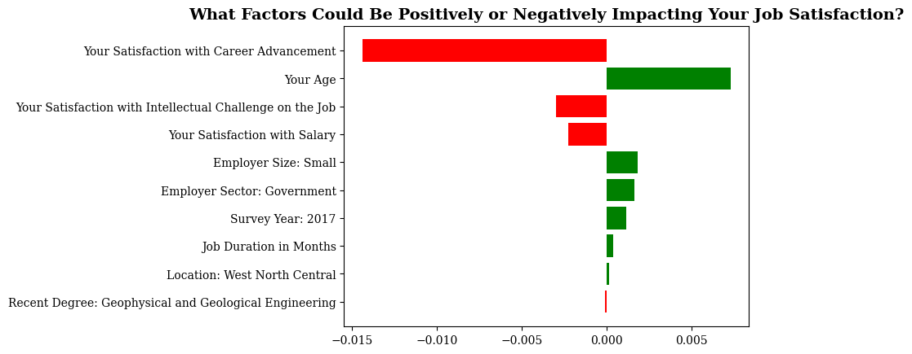
        
LIME Test Factors

    

## What could this be telling us?

1. For this particular individual, they're highly likely to experience high job satisfaction (81% likely)

2. From training our model, factors like their age, company size and emloyer sector are likely to be some of the factors pushing their likelihood of 'high satisfaction' up

3. In contrast, it looks like their satisfaction with career advancement could be driving their satisfaction **down**, so the user may want to look into what their levels of satisfaction are and whether this needs further investigation.

# 5. 'So what?' Value for policymakers and jobseekers

#### Given someone with a similar profile/attributes to what they've inputted, the model predicts their likelihood of job satisfaction and identifies contributing factors. This can be valuable for both **policymakers** and **jobseekers** in the following ways:

    

        
    

    
  <!-- Increased font size here -->
        <h3 style="font-size: 26px;">1. Value for Policymakers</h3>  <!-- Increased heading size -->
        <ul>
            <li><strong>Explore and address wider disparities in job satisfaction</strong> - the model can reveal which demographics, industries, or regions experience lower satisfaction, offering data-driven guidance on where interventions may be most needed.</li>
            <li><strong>Use insights to formulate targeted labour market interventions</strong> - by understanding which factors (e.g., salary, job security, career advancement) are key drivers, policymakers can craft policies to improve conditions where it matters most.</li>
            <li><strong>Revise and update the predictive model against a changing landscape</strong> - the labor market is dynamic, and regular updates to the model can ensure that insights remain relevant as the job market evolves.</li>
        </ul>
    

    

        
    

    
  <!-- Increased font size here -->
        <h3 style="font-size: 26px;">2. Value for Job Seekers</h3>  <!-- Increased heading size -->
        <ul>
            <li><strong>Understand the key drivers of job satisfaction</strong> - the app helps job seekers identify which factors, such as salary, work-life balance, career advancement, or job security, play the most significant role in overall job satisfaction.</li>
            <li><strong>Personalise your job search</strong> - by honing in on the aspects of a job that matter most to you, the predictive tool has the potential to provide tailored job recommendations that align with your priorities for satisfaction, helping you make more informed decisions.</li>
            <li><strong>Track evolving job satisfaction trends</strong> - as the job market evolves, the app can help you stay updated on which industries or roles offer higher satisfaction, allowing you to adjust your career goals accordingly.</li>
        </ul>
    

# 6. Next Steps

While we've demonstrated the value of the model using tools like **LIME** to explain individual predictions, there are several key steps ahead to further develop this work into a robust **proof of concept application**.

## 1. Web Scraping Job Forums and Postings
To enrich the model’s understanding of **job satisfaction drivers**, web scraping techniques will be employed to gather data from:
- **Job forums** where employees discuss their job experiences, challenges, and satisfaction levels.
- **Job postings** to analyze trends in skill requirements, job roles, benefits, and perks that may influence job satisfaction.
- This unstructured data will help **complement** the existing dataset and provide additional insights into emerging trends and employee expectations.

## 2. Developing the Proof of Concept Application and Use Case

The end goal is to explore the development of an application that enables:

- **Jobseekers** to input their profile details and receive predictions about their likelihood of job satisfaction, as well as the factors contributing to that prediction.
- **Policymakers** to explore trends in job satisfaction across industries, demographics, and geographies, allowing for targeted interventions.

**Key features of the proof of concept application**:

- **User-friendly interface** that visualises predictions and provides explanations using LIME.
- **Customisable inputs** for jobseekers to adjust variables such as salary expectations, job location, and role-specific factors.
- **Real-time data** updates from job postings to keep the model relevant in a changing labor market.

By iterating on these next steps, this model can evolve into a valuable tool for both **jobseekers** and **policymakers**, offering actionable insights into job satisfaction and its key drivers.

*Watch this space for a demo of our proof-of-concept Streamlit app...*

# 7. Final Comments and Reflections

This project was a rewarding experience, offering me the chance to work with rich data and apply a variety of machine learning techniques. Below are some reflections on the process:

- **Key Challenges**:
  - Navigating and cleaning multiple years of survey data in different formats was time-consuming but essential to ensure consistency, and readable names of survey questions oftened coded as a string of numbers.
  - Addressing class imbalance (90% majority class) through techniques like **SMOTE** to improve prediction for underrepresented cases of 'Low Satisfaction.'
  - Selecting the most relevant features from over 200+ survey questions, and applying domain knowledge to filter down to job-related variables.

- **What I Loved**:
  - Exploring different machine learning models (from Decision Tree to Neural Network) and tuning hyperparameters to enhance performance.
  - Visualising job satisfaction insights through tools like **Matplotlib** and **LIME**, and seeing how individual features contribute to predictions.
  - Creating the **proof of concept** for a predictive tool that can provide real value to jobseekers and policymakers.

- **Technical Skills Showcased**:
  - Advanced **data preprocessing** and **feature engineering**, including constructing meaningful variables like **job duration**, using loops and functions to make mergin data more efficient
  - Mastery of **Logistic Regression**, **Random Forests**, and exploration of **Neural Networks** with detailed hyperparameter tuning.
  - Applying **explainable AI** techniques with **LIME** to interpret model predictions and generate actionable insights.

- **Excitement for Policymakers**:
  - I'm excited about the potential of this tool to help policymakers explore the **drivers of job satisfaction** across various demographics and industries.
  - With real-time data and future enhancements, this model could serve as a valuable resource for creating **targeted labor market interventions** and improving job conditions.

This project has been a fantastic opportunity to combine technical skills with impactful real-world applications, and I look forward to further developing it!

---
#### Links to primary datasets used for this project

https://ncses.nsf.gov/surveys/national-survey-college-graduates/2021
https://ncses.nsf.gov/423/assets/0/file/ncses_nscg.pdf
https://ncses.nsf.gov/pubs/nsf23306/assets/nsf23306.pdf
https://ncses.nsf.gov/explore-data/microdata/national-survey-college-graduates

---

# 8. Note on Repository 

* `data` and `data_for_eda`
    - contains link to copy of the dataset 
    - saved copy of aggregated / processed data

* `interactive_app`
    - Contains the code for the interactive proof-of-concept application that predicts job satisfaction.
    - Uses preprocessed data and models to provide real-time predictions for jobseekers and insights for policymakers.

* `models`
    - `joblib` dump of final model(s)

* `notebooks`
    - Contains all final notebooks involved in the project

* `preprocessed_variables`
    - Contains preprocessed datasets that were produced after extensive preprocessing.
    - These datasets are crucial for model evaluation and to feed into the interactive application.
    - Includes scaled, encoded, and resampled datasets ready for modeling.

* `project_docs`
    - contains presentations from sprint 1 to 3, and additional supplementary materials where appropriate

* `references`
    - contains any academic papers of literature used to inform this project

* `src`
    - Currently not in use. The project is primarily developed and analyzed through Jupyter notebooks.
    - If future development requires, the `src` folder can be used for modular Python scripts refactored from the notebooks.

* `visualisations`
    - Contains aany key output figures, plots, and graphs generated during analysis and modeling.
    - Includes confusion matrices, feature importance plots, and relevant visualisations used in notebooks and presentations.

* `.gitignore`
    - Part of Git, includes files and folders to be ignored by Git version control

* `nivi_capstone.yml`
    - Conda environment specification for this project
* `README.md`
    - Project landing page (this page)

